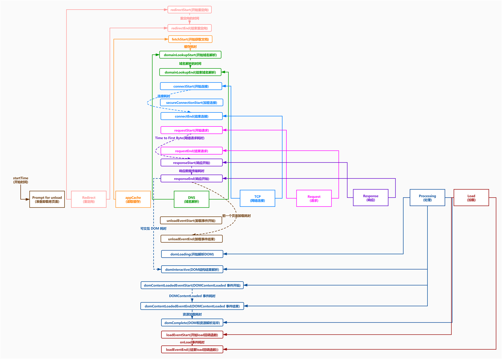

#### 一、为什么要做前端监控

1. 方便定位和解决线上问题
2. 做产品的决策依据,提供运营的数据支撑
3. 为业务扩展提供了更多可能性

#### 二、前端监控流程

- 前端埋点
- 数据上报
- 分析和计算 将采集到的数据进行加工汇总
- 可视化展示 将数据按各种维度进行展示
- 监控报警 发现问题后按一定的条件触发报警

#### 三、常见的埋点方案 

##### 1. 代码埋点

- 代码埋点，就是以嵌入代码的形式进行埋点,比如需要监控用户的点击事件,会选择在用户点击时,插入一段代码，保存这个监听行为或者直接将监听行为以某一种数据格式直接传递给服务器端
- 优点是可以在任意时刻，精确的发送或保存所需要的数据信息
- 缺点是工作量较大

##### 2. 可视化埋点

- 通过可视化交互的手段，代替代码埋点
- 将业务代码和埋点代码分离，提供一个可视化交互的页面，输入为业务代码，通过这个可视化系统，可以在业务代码中自定义的增加埋点事件等等,最后输出的代码耦合了业务代码和埋点代码
- 可视化埋点其实是用系统来代替手工插入埋点代码

##### 3. 无痕埋点

- 前端的任意一个事件都被绑定一个标识，所有的事件都别记录下来
- 通过定期上传记录文件,配合文件解析，解析出来我们想要的数据，并生成可视化报告供专业人员分析
- 无痕埋点的优点是采集全量数据,不会出现漏埋和误埋等现象
- 缺点是给数据传输和服务器增加压力，也无法灵活定制数据结构

#### 四、第三方监控方案

##### 1. 商业产品

- [神策数据](http://www.zhufengpeixun.cn/2020/html/101.1.monitor.html)
- [GrowingIO](https://www.growingio.com/)
- [Fundebug](https://www.fundebug.com/)
- talkingdata、百度统计等...

##### 2. 开源产品

- [Sentry](https://sentry.io/welcome/)
- [BetterJS](https://github.com/BetterJS/doc)
- [fee（灯塔）](https://github.com/LianjiaTech/fee)

#### 五、前端监控目标

> 前端监控大致分为三种类型：错误监控、性能监控、用户行为监控

##### 1. 稳定性(stability) 

错误名称 | 备注
---|---
JS错误	 | JS执行错误或者promise异常
资源异常	| script、link等资源加载异常
接口错误	| ajax或fetch请求接口异常
白屏	   | 页面空白

##### 2. 用户体验(experience)

错误名称 | 备注
---|---
加载时间	 | 各个阶段的加载时间
TTFB(time to first byte)(首字节时间)	| 是指浏览器发起第一个请求到数据返回第一个字节所消耗的时间，这个时间包含了网络请求时间、后端处理时间
FP(First Paint)(首次绘制)	| 首次绘制包括了任何用户自定义的背景绘制，它是将第一个像素点绘制到屏幕的时刻
FCP(First Content Paint)(首次内容绘制)	   | 首次内容绘制是浏览器将第一个DOM渲染到屏幕的时间,可以是任何文本、图像、SVG等的时间
FID(First Input Delay)(首次输入延迟)	   | 用户首次和页面交互到页面响应交互的时间
FMP(First Meaningful paint)(首次有意义绘制) | 首次有意义绘制是页面可用性的量度标准
卡顿	| 超过50ms的长任务

##### 3. 业务(business) 

错误名称 | 备注
---|---
PV	 | page view 即页面浏览量或点击量
UV	| 指访问某个站点的不同IP地址的人数
页面的停留时间		| 用户在每一个页面的停留时间

#### 六、编写监控采集脚本

##### 1. 前期准备

- [日志服务(Log Service,简称 SLS)](https://sls.console.aliyun.com/lognext/profile).是针对日志类数据一站式服务，用户无需开发就能快捷完成数据采集、消费、投递以及查询分析等功能，帮助提升运维、运营效率，建立 DT 时代海量日志处理能力
- [Web Tracking](https://help.aliyun.com/document_detail/31752.html)

##### 2. 监控错误

- JS错误
- Promise异常
- 资源异常

##### 3. 接口异常

- xhr
- fetch

##### 4. 白屏

判断页面是否是白屏
1. 通过把页面划分成x轴和y轴，分别取x轴和y轴上的十个点
2. 判断这20个点是否是容器元素，如果都是，则是白屏
3. 该方法得在页面完全load情况执行
  
##### 5. 加载时间

- [PerformanceTiming](https://developer.mozilla.org/zh-CN/docs/Web/API/PerformanceTiming)

字段 | 描述 | 计算方式 | 意义 
---|---|---|---
unload	 | J前一个页面卸载耗时	| unloadEventEnd – unloadEventStart	 | -
redirect	| 重定向耗时	| redirectEnd – redirectStart	| 重定向的时间
appCache		| 缓存耗时	| domainLookupStart – fetchStart	| 读取缓存的时间
dns		| DNS 解析耗时	| domainLookupEnd – domainLookupStart	 | 可观察域名解析服务是否正常
tcp | TCP 连接耗时 | connectEnd – connectStart | 建立连接的耗时
ssl | SSL 安全连接耗时 | connectEnd – secureConnectionStart | 反映数据安全连接建立耗时
ttfb | Time to First Byte(TTFB)网络请求耗时 | responseStart – requestStart | TTFB是发出页面请求到接收到应答数据第一个字节所花费的毫秒数
response | 响应数据传输耗时 | responseEnd – responseStart | 观察网络是否正常
dom | DOM解析耗时 | domInteractive – responseEnd | 观察DOM结构是否合理，是否有JS阻塞页面解析
dcl | DOMContentLoaded 事件耗时 | domContentLoadedEventEnd – domContentLoadedEventStart | 当 HTML 文档被完全加载和解析完成之后，DOMContentLoaded 事件被触发，无需等待样式表、图像和子框架的完成加载
resources | 资源加载耗时 | domComplete – domContentLoadedEventEnd | 可观察文档流是否过大
domReady | DOM阶段渲染耗时 | domContentLoadedEventEnd – fetchStart | DOM树和页面资源加载完成时间，会触发domContentLoaded事件
首次渲染耗时	| 首次渲染耗时	| responseEnd-fetchStart | 加载文档到看到第一帧非空图像的时间，也叫白屏时间
首次可交互时间 | 首次可交互时间	| domInteractive-fetchStart	 | DOM树解析完成时间，此时document.readyState为interactive
首包时间耗时 | 首包时间	 | responseStart-domainLookupStart	 | DNS解析到响应返回给浏览器第一个字节的时间
页面完全加载时间	| 页面完全加载时间	| loadEventStart - fetchStart
onLoad | onLoad事件耗时	| loadEventEnd – loadEventStart
##### 6. 卡顿

响应用户交互的响应时间如果大于100ms,用户就会感觉卡顿

##### 7. pv

- [navigator.sendBeacon()](https://developer.mozilla.org/zh-CN/docs/Web/API/Navigator/sendBeacon).方法可用于通过HTTP将少量数据异步传输到Web服务器。通常尝试在卸载（unload）文档之前向web服务器发送数据。

##### 七、查询报表

当数据上传到SLS之后，需要写SQL...